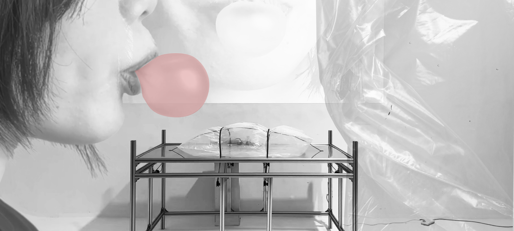

# Who Am I? Why Do I Create?

## My Past Work: The Absence of an “I”

This is my first piece of writing about my thesis at New York University. Today is the day before our Week 6 class.

For the past two weeks, I have been hesitating, going back and forth. I have remained uncertain about what actually interests me, what stories I want to tell, and what I should research. In the past, my creative practice was full of intuition. Whatever I saw, whatever happened to come to mind, I would express it and turn it into a work. I explored Herbert Marcuse’s themes in *Eros and Civilization*, trying to connect them with Freud’s physiological concept of the oral stage, and to develop the idea that “people use oral activities to relieve the repression of Eros brought about by the modern industrial environment.”

Later, I thought that sand and patterns could make an interesting interactive game, so I used a loudspeaker to create Chladni figures that could vibrate freely.

Looking back now, however, all of these were works born of a sudden intuition. They began with a simple thought. Then came learning, piecing together knowledge, and assembling forms and technologies, until I found a mode of expression that felt like mine—or, more precisely, one that I liked—and eventually established some kind of connection with an audience. Yet these works reveal nothing distinctive about “me.” They could have been made by anyone, from any cultural environment, with any educational background. This sense of “anyone” has left me with an enormous feeling of emptiness in my thesis research: I can choose any direction, but I cannot see myself in it. I do not know what my interests are. In my past work, I cannot see who I am, where I come from, or what I want to express or influence.

I felt this particularly strongly after exhibiting these two works in Santa Fe. When I found myself fully immersed in a cultural environment entirely different from the one I had known, I became aware of the existence of this “I.” I longed to get to know him, to see him, to recognize him. As Joseph Brodsky [illustration] put it, being abroad is “like being put into a sealed capsule and hurled into outer space.” Freed from the gravitational pull of one’s native language and the realities of one’s homeland, every wanderer is tested by loneliness and emptiness. At the same time, these experiences prompt them to look back upon their own cultural memories from within an unfamiliar environment.

## MoMA PS1

On October 4, 2026, I visited the exhibitions at MoMA PS1. They covered several themes, but most reflected on history and on the scars it leaves on people and society. On the ground floor of the main hall was an exhibition that brought together multiple media into a complex experience. Its theme was opposition to nuclear weapons and the politics of power behind them. In one towering painting, people were crowded together, their limbs twisted, deformed, and distorted by the force of a nuclear bomb. Beneath it was a line of text: “no one should have the power to kill us all.”

The works on the third floor addressed the lasting effects of changes in cities and policies. In the mid-1990s, Mexico’s entry into the North American Free Trade Agreement brought dramatic changes to its cities and factories. Housing prices in urban neighborhoods rose sharply, and large numbers of newcomers moved in, also displacing many residents who had lived there for years. With inadequate government regulation and complex economic and political problems, guns and drugs became widespread in the cities. Against this historical backdrop, an artist dismantled abandoned factory buildings, collected the concrete rubble, and ultimately cast it into a massive rectangular block to commemorate the history of this land.

Another artist collected water that had been used to wash the bodies of people injured or killed in gun- and drug-related conflicts, then poured it onto an asphalt road as an act of mourning.

Meanwhile, Mexico’s development has been bound up with the United States at every turn. One work consisted of a large number of misshapen, unusable everyday glass objects. These served as a metaphor for the experience of some Mexicans who crossed into the United States without authorization, only to discover that life there was not as good as they had imagined. The deformed glass symbolized the shattering of their hopes for a better life.

Two other works expressed similar themes through different forms. Both mourned people killed in street shootings and conflicts. One was a performance in which the artist repeatedly scrubbed streets where conflicts had taken place, attempting to mourn the dead through water and traces. The other work directly collected dust from all the sites of conflict and placed it in a blower that continually filled the room with this dust. When viewers entered the room, these conflicts would become forever incorporated into their bodies.

Art is society’s eternal camera. In each work, to a greater or lesser extent, I could see the artist’s very specific life experiences, as well as the broader historical and social circumstances they had lived through as an individual. I could feel unmistakably that these real, lived experiences had shaped both the artist and the work itself.

Seeing these Mexican border artists, these artists who had experienced the rapid economic transformations of Mexico and North America, I began to wonder about the contemporary Chinese artists from the environment in which I grew up. What had they lived through, and what had they expressed? What had I lived through? What historical and social experiences had ultimately made me who I am?

## *Chinese Contemporary Art Since 2000*

Chinese artists active in 2000 were generally born between the 1950s and the 1970s. They lived through China’s most turbulent revolutionary and political years—the Cultural Revolution and the Down to the Countryside Movement—and also witnessed the Reform and Opening-Up era, when China’s economy underwent its most thorough and rapid transformation. The artists of this generation followed markedly different paths. The older group remained committed to expressing the political theater they had experienced, a reality that was still surreal. They favored powerful political symbols and absurd realities, creating striking symbolic contrasts. A particularly representative example is Wang Guangyi’s *Great Criticism*, in which he juxtaposed exalted communist imagery with Coca-Cola, a symbol of Western capitalism. The enormous clash between these two worlds produced a profound uncertainty. The works offered no explanation of their position; they seemed more like a dissolution of past values, placing themselves in a vacuum. Whatever the case, politics and symbols have always been among the important elements shaping Chinese history and Chinese contemporary art. These artists had lived through the days of loudly proclaimed socialism and people’s communes. They had seen countless Chinese big-character posters and other posters in the style of the people’s communes. These were vivid, unforgettable memories left by an era.

*Coca-Cola work by Wang Guangyi.*

*Work by Fang Lijun.*

The other group was relatively younger. No longer confining themselves to playing with symbolic politics and history, these artists began to focus on ordinary people within the broader historical context, and to turn toward their own inner lives.

> “Since the beginning of the new century, a question has become apparent: people may ask whether these works, constructed around a binary opposition between the ‘individual’ and ‘society,’ became a focus of attention and seemed so important only because of the particular social context of their time. Once they lose the historical context they addressed, do they also lose their primary value? Worse still, if those artists, in the process of repeating themselves, gradually revealed a disconnect between their personal thinking and a new, constantly changing reality, then the various politicized symbols and images now proliferating in contemporary art are almost a manifestation of inertia and servility in artistic thought, a lubricant between an avant-garde identity and commercial rewards, a counterfeit ‘China card.’ By drawing on ideological critique, especially on a simplified mode of binary thinking, many so-called artists are actually concealing their own impoverishment. Bearing witness and offering critique are becoming empty gestures.”

> “How can contemporary painting shed the heavy burden imposed by ideological constraints and return to a desire for the purity of painting as a language and a form? To a considerable extent, these artists have restored art’s authentic mission, entering a cyclical process of ‘self-construction.’”

Painters began to seek expressions of feeling, making ideological statements and discussions of social and political issues less explicit. The content of their paintings began to turn toward their own feelings and experiences: the absurd, the beautiful, or abstract experiences of life.

*Work by Xie Nanxing.*

> “How can contemporary painting shed the heavy burden imposed by ideological constraints and return to a desire for the purity of painting as a language and a form? To a considerable extent, these artists have restored art’s authentic mission, entering a cyclical process of ‘self-construction.’”

Well, to be honest, I am neither a professional art historian nor an art critic. The excerpts above from *Chinese Contemporary Art Since 2000*, and my discussion of them, reflect only my impressions after hastily reading about a third of the book over the past two days. I am a creator who is not particularly diligent, and also an amateur art enthusiast who enjoys devouring analyses of other people’s work. Yet the more I read about and experience their work, the more curious I become about myself as well.

As my understanding grows, I feel countless questions arising within me: questions about myself, about the times I have lived through, and about my circumstances. What kind of person have the social and political changes I have experienced made me? What would the values I see and want to express look like? I consider myself someone who often reflects on life, but until now, I had never imagined that this might have anything to do with my future creative practice. Should I include politics in my work? Should I tell stories about those cultural conflicts? I am full of curiosity about China’s social structure, population, politics, and economy, but which of these have actually made me who I am? I am not even sure what values I hold. I observe the world greedily and ignorantly, like a spectator in the theater of the world.

At the same time, I wonder: now that I am actually in the United States, far from my original cultural context, what different identity have I taken on? What cultural identity do I actually hold? I feel that, as people seeking to express ourselves, we can no longer work as we did before, simply through cultural and political conflicts between nations. Amid today’s more intertwined and less visible cultural tensions, I do indeed feel a quiet sense of losing my identity. Or perhaps this invisible, elusive cultural identity is itself a distinct and striking cultural identity.

## Next Steps

All right. I admit that my limited wisdom does not allow me to uncover many profound conclusions or words of insight. What remains for me is a vast collection of fragmented questions, but they are enough to guide me forward. Next, I think I will carefully recall and analyze the times and environment I have lived in, and the ideas my education has left with me. Which of these matter to me? Which interest me? Which evoke feelings that I can express?
