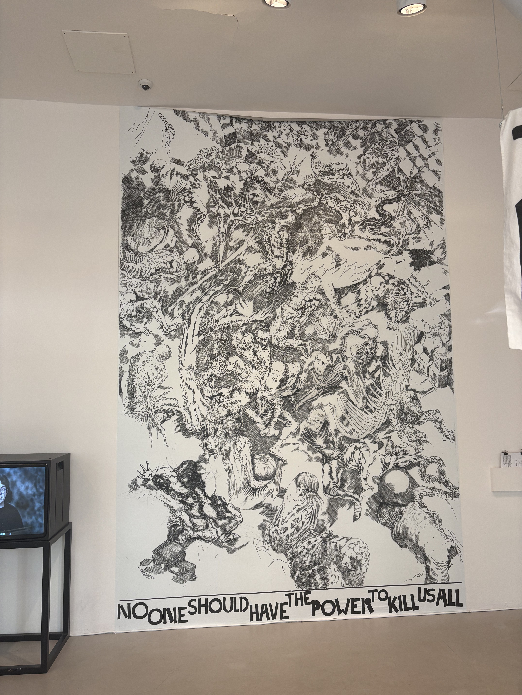
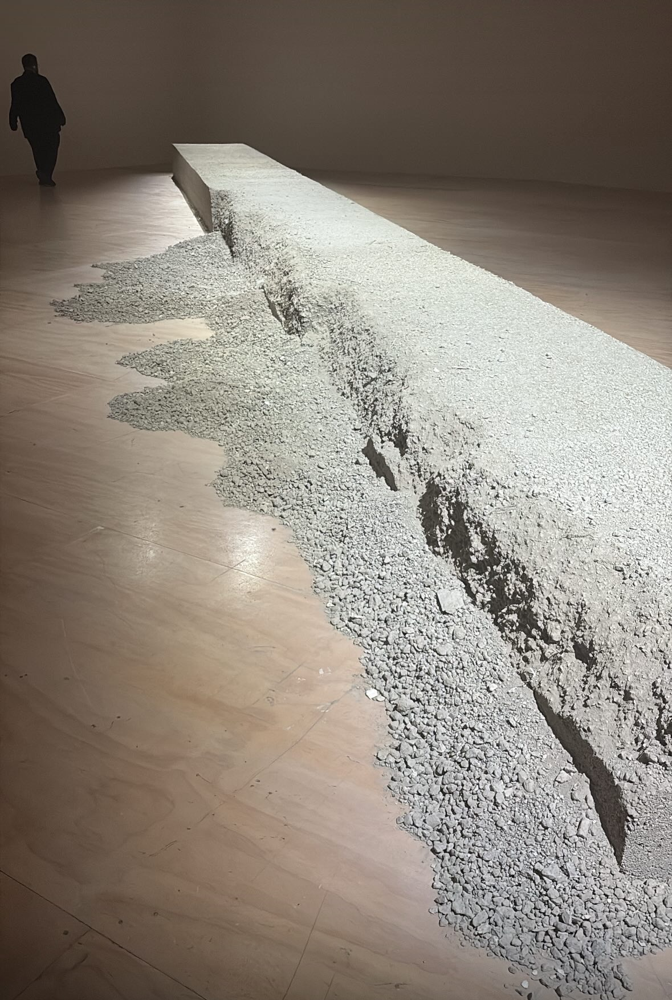
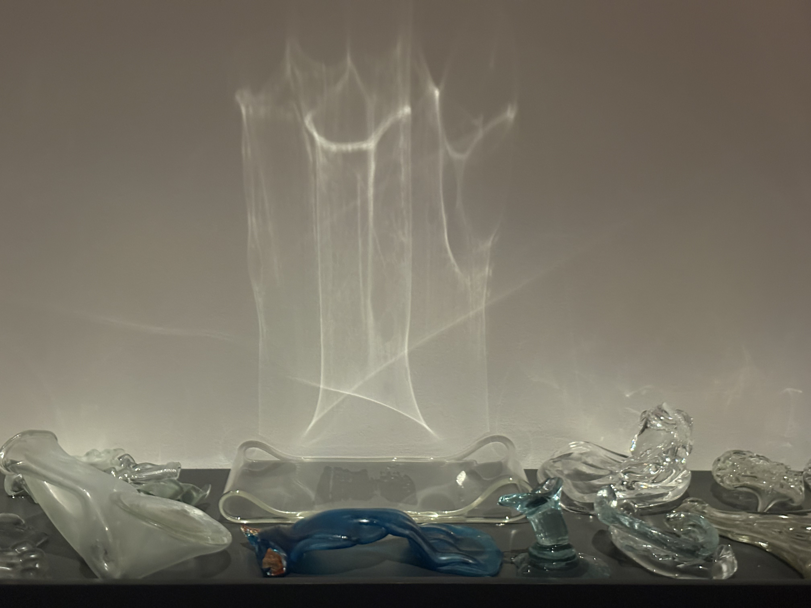
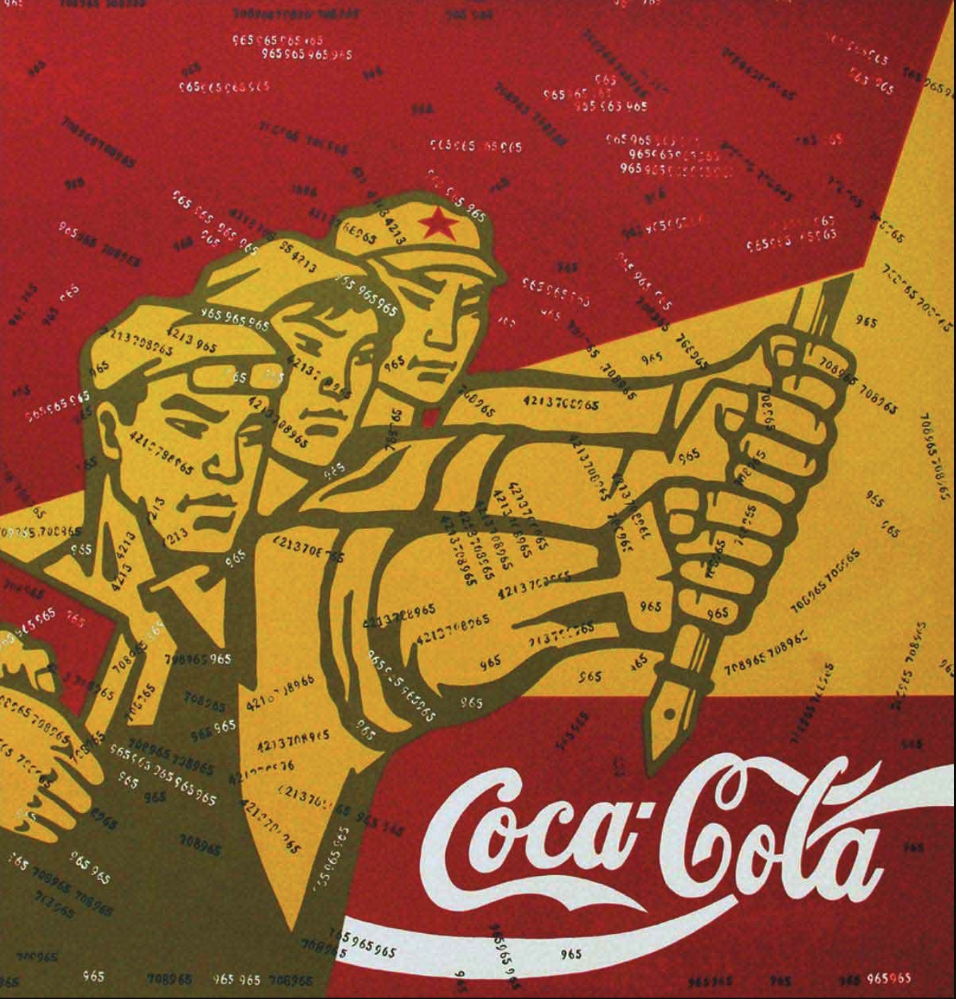
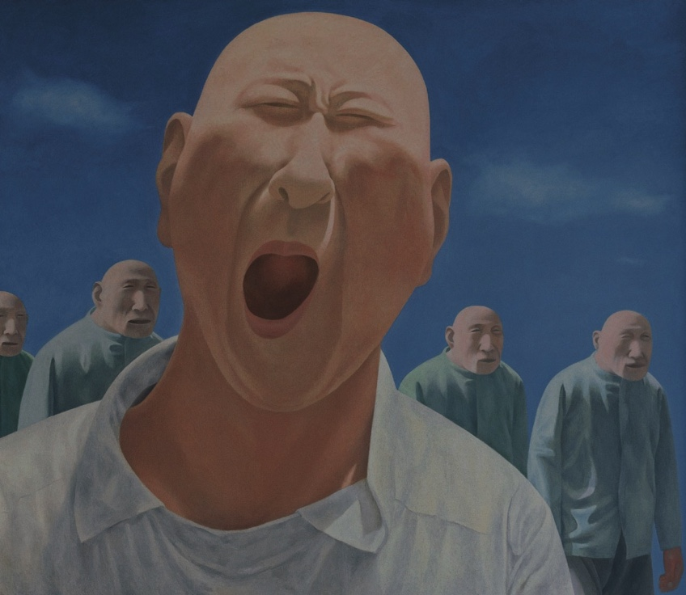
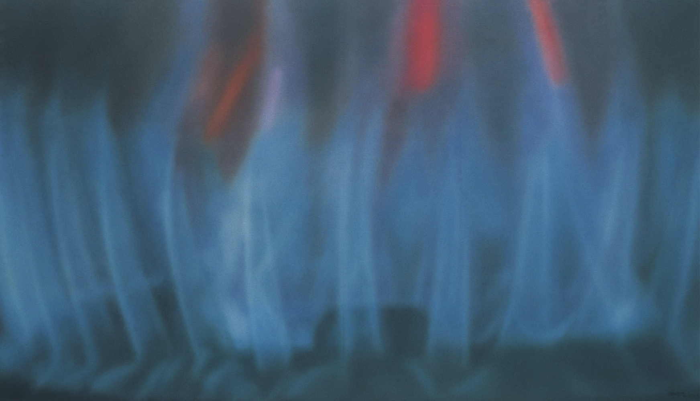

# 我是谁？我为什么而创作？

## 过往，没有“我”的组品

这是我的第一篇关于我在纽约大学Thesis的文章。今天是Week6上课的一天前。

最近的两周，我一直在犹豫，徘徊。我一直不确定，我到底在对什么感兴趣，我想讲什么故事，我应该研究什么。过去，我的创作充满着直觉。我看到什么，我偶然想到什么，我就把它讲出来，做成作品。我去探讨Herbert Marcuse关于爱欲与文明的主题，尝试将它和弗洛伊德的口欲期这一生理概念进行联系，构建一个“人们通过口腔活动，缓解现代工业环境下带来的爱欲的压抑”这一主题。又或者后面我觉得沙子与图形会是一个有趣的交互游戏，所以我用扬声器制作可以自由振动的克拉尼图形。

但我现在回看，这一切都是某种突然的直觉式的作品，他们因一个简单的念头起，然后学习，拼接知识，拼接形式与技术，找到属于我的（或者说我喜欢的）表达形式，最终和观众产生某种链接。可是这些作品无法透露任何关于“我”的特点。这个作品可以是任何人的作品，来自任何的文化环境，有过教育背景。这种“任何”让我这次的Thesis研究陷入一种巨大的空虚，任何方向都可以选择，但看不到我自己。我不知道我的兴趣是什么。从我过往的作品里，我看不到我是谁，我来自哪里，我又想要表达什么，影响什么。

这个想法尤其在我在Santa Fei 展览了这两个作品之后感受尤其深，当我真正深处一个与我过往完全不同的文化环境的时候，我意识到了“我”的存在。我渴望认识他，看到他，识别他。如同约瑟夫·布罗茨基[插图]所言，置身于域外“就像是被装进密封舱扔向外层空间”，脱离了母语及本土现实的引力，孤独和虚无的滋味考验着每个漂流者，同时，也促使他们在陌生的环境里反观自身的文化记忆。

## MOMA PS1

2026年10月4日，我去看了Moma PS1美术馆的展览。整个展览覆盖多个主题，不过多数都是对历史的反思，对于历史留给人们，留给社会的伤痕的反思。大厅一楼留下的是一整个符合的多媒介体验的展览，展览的主题是反对核武器和核武器背后的强权政治。一副高大的绘画，人群挤在一起，人们的肢体因核弹的威力而扭曲，变形，畸变。下面一行文字“no one should have the power to kill us all".

三楼的作品，是关于城市、政策的改变从而留下的影响。1990s年中页墨西哥城市加入北美自由贸易协定，城市，工厂的剧烈变化，城市内部地区的房价剧烈上涨，大量外来人口流入，同时也挤走了许多原本生活多年的居民。由于政府的缺乏管控与复杂的经济政治问题，城市内枪支毒品泛滥。在这个历史背景下，艺术家为了纪念这片土地的历史，拆除废弃的工厂房屋，收集拆卸下来的房屋混凝土碎石，最终铸成一个巨大的方形长条。

还有的艺术家通过收集那些清洗过因枪支毒品冲突而受伤的人的水，将他们泼洒在柏油马路上以示悼念。

同时，墨西哥的发展时时刻刻和美国有关，有一件作品烧制了大量畸形无法使用的日常玻璃制品，通过以此隐喻，部分偷渡到美国的墨西哥人在来到这片土地之后发现生活并不如他们所设想的那样美好，畸形的玻璃象征着一种生活希望的破灭。

还有两件作品用不同的形式表达了相似的主题。他们都在悼念那些死于街头枪杀和冲突的人们。一个用行为艺术，不断擦洗那些曾经发生过冲突的街道，试图用水和痕迹为他们悼念。另一个作品直接收集了所有冲突现场的灰尘。将他们放于鼓风机中不断将这些灰尘充满房间。当观众进入房间时，这些冲突将永远的与观众的身体融合。

艺术，是社会永恒的照相机。每一件作品，或多或少都可以看到如此具体的作者的生活经历，作者作为个体体验的宏大的历史背景以及社会环境。我能够十足的感受到是这些真实的经验性的感受构成了作者，构成了作品本身。

看到这些墨西哥裔的边境艺术家，这些经历了墨西哥与北美经济快速变革的艺术家。我不禁开始好奇，在我成长的环境中，那些中国的当代艺术家他们经历了什么，他们又表达了什么。我经历了什么，又是什么历史与社会的经验最终构成了我。

## “2000年以来的中国当代艺术”

2000年活跃的中国艺术家普遍出生于1950年代到70年代。他们经历了经历了中国最动荡的革命与政治时期，文化大革命和上山下乡活动，同时也看到了中国经济改革最彻底最快速的改革开放时代。这个年代的艺术家他们有着极其不同的分化路径。老一派，执着的在表达他们经历到的政治剧场，那还是一个魔幻的现实世界。他们喜欢用强力的政治符合和荒诞的现实，造成巨大的符号性的反差。最具代表的是王广义的大批判，他将崇高的共产主义形象与象征着西方资本主义的可口可乐拼接在一起，两个世界的巨大冲突，构成的一种巨大的不确定性。作品不做任何立场的阐释，更多像是一种对过去价值的消解，将自己放在一个真空的位置。但无论怎样，政治与符号一直是构成中国历史以及中国当代艺术的重要元素之一。因为他们经历了那个高喊社会主义，人民公社的日子，他们看到了无数人民公社风格的中式大字报与海报。那是一个时代留下的不可忘却的鲜明记忆。

*王广义：可口可乐作品。*

*方力钧的作品。*

另一派相对年龄更为年轻，他们不再局限于玩弄符号化的政治与历史，艺术家们开始关注在宏大历史背景下的市井人物，关注自己的内心。

“进入新世纪以来，有一个问题得以被显明出来——人们会问，这些以“个人/社会”二元对立模式建构起来的作品，是否因为处在当时特定的社会背景下才被置于焦点，才显得如此重要？一旦它们丧失了所针对的历史语境，是否也就丧失了自身最主要的价值？更糟糕的是，如果说那些艺术家在陷入自我复制的过程中逐渐显示出个人思考与新的、不断变化的现实之间的脱节，那么，如今泛滥于当代艺术之中的各种政治化符号和图像，则几乎是一种艺术思维的惰性与奴性表现，一种先锋身份与商业回报之间的润滑油，一套伪造的“中国牌”——借助于意识形态的批判，尤其是借助于简单化的二元对立思维模式，很多所谓的艺术家其实是在掩盖自身的贫乏，见证与批判正在成为一种空洞的姿态。“

“当代绘画如何卸除由意识形态的束缚带来的那份沉重负担感，回归到对于绘画这种语言形式纯粹性的渴求，他们从很大程度上恢复了艺术的本真性使命，进入一种“自我建构”的循环过程之中。“

画家们开始追求感受性的表达，开始模糊意识形态的输出，社会政治议题的讨论。画作的内容开始转向自己的感受经历，荒诞，美好，或者抽象的生命感受。

*谢南星的作品。*

“当代绘画如何卸除由意识形态的束缚带来的那份沉重负担感，回归到对于绘画这种语言形式纯粹性的渴求，他们从很大程度上恢复了艺术的本真性使命，进入一种“自我建构”的循环过程之中。”

好吧，坦白讲我并不是一个专业的艺术史学家或者艺术批评家，这本”2000年以来的中国当代艺术“以上的摘录和内容也都只是我近两天草草阅读了三分之一的感受。我是一个不怎么勤快的创作者，同时也是一个业余的喜欢啃食别人作品分析的艺术爱好者。但我愈发阅读与体验这些他人的作品，我越发的对我自己同样感到好奇。

我感觉随着我的理解，我心中有无数对自己的问题，对我经历的时代，我的处境有无数的问题。我经历的这些社会和政治的变革塑造了一个怎样的我？我看到的，我想要表达的价值观有会是什么样子的？我自认为是一个时常会在生活中反思的人，但我在此之前我从未设想过这会与我未来的创作有关。我应该在创作中囊括政治么？我应该讲述那些文化的冲突？我对中国的社会结构，人口，政治，经济充满着好奇心，但这些又有哪些真正构成了我？我甚至仍不确定我持有了何种价值观。我贪婪又无知的观察着世界，像一个世界剧场下的观众。

同时我又会想，当我真的身处远离我原本文化语境的美国。我又变成了一个怎样不同身份的人。我到底在持有如何的文化身份。我感到，表达者不能再像过往那样，可以简单的通过国家与国家间的文化与政治矛盾进行表达，在如今更为融合且隐形的文化张力下，的确，我感到一种隐隐的身份丧失。又或者说，这种隐形的，难以琢磨的文化身份，本身就是一个鲜明而突出的文化身份。

## 下一步

好吧。我承认，我有限的智慧无法真正挖掘多少深入的结论与智慧的语论。留给我的，只有一大片碎片的，但足以指引我前进的问题。接下里我想我会仔细的回忆，分析我生活的时代，我生活的环境，我被教育留存下的观念有哪些。哪些是我在意的，是我感兴趣的，是我有所感想而能够表达的。